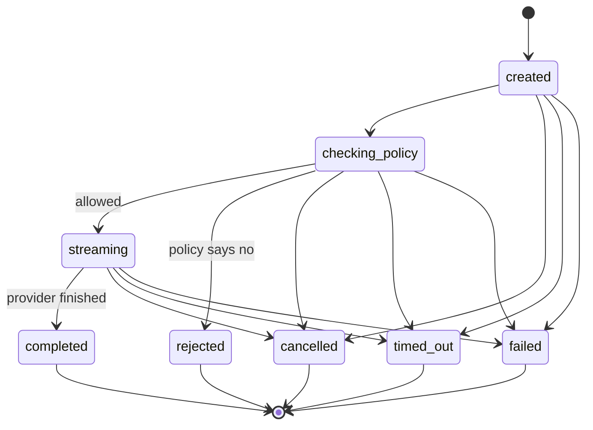

# Reliable AI Conversation Runtime

A small, bounded runtime that manages **one streamed conversational turn** from request to a single,
honest terminal state. It covers: a policy gate that runs before the model, provider streaming,
cancellation, timeout, provider failure, terminal-state races, a persistence boundary, and a safe
operational trace. No live model, network access or API key is needed.

TypeScript · Node · SQLite (Node's built-in `node:sqlite`, no native dependency) · Vitest · CLI

---

## The Problem

AI conversation runtimes in production face a class of reliability problems that are easy to overlook
until they cause real incidents:

- **Partial success is not success.** A provider can stream 90% of a reply and then crash. Without an
  explicit terminal state, the caller has no way to know whether the run completed or not.
- **Secrets leak into logs.** Provider errors often carry API keys in headers or config objects.
  Naive logging of those errors exposes credentials.
- **Hidden reasoning leaks into storage.** Some providers expose internal chain-of-thought in the
  stream. If the runtime stores every chunk, that reasoning ends up in the database and in logs.
- **Competing terminal states corrupt history.** A timeout and a provider completion can race. If
  both win, the run is recorded as both `completed` and `timed_out`, and the conversation history
  is corrupt.
- **Process crashes leave runs stuck.** A SIGKILL mid-stream leaves a run in a non-terminal state
  forever unless the runtime explicitly recovers it on restart.
- **Unsafe inputs reach the model.** Without a pre-response gate, credential-shaped strings,
  blocked content, and empty inputs are forwarded to the provider and billed.
- **No audit trail.** Without an ordered, tamper-evident trace, it is impossible to reconstruct
  what happened during a failed or cancelled run.

---

## How This Project Solves It

### 1. Explicit, enforced terminal states

Every run ends in exactly one of five terminal states: `completed`, `rejected`, `cancelled`,
`timed_out`, or `failed`. The state machine in `stateMachine.ts` has no outgoing edges from
terminal states. The SQLite schema enforces this with a trigger. Two competing terminal attempts
(e.g. timeout racing a provider completion) are resolved synchronously in the event loop — the
first one wins, the second is recorded in `ignored_signals` and discarded.

### 2. Pre-response policy gate

`RulePolicy` runs before the provider is ever invoked. It rejects empty inputs, inputs that are
too long, inputs that contain credential-shaped strings, and inputs that match a blocklist. A
policy that throws is treated as a failure (fail closed), never as "allowed". Rejected inputs are
never stored as conversation content.

### 3. Safe operational trace

The trace contains only flat primitives — no nested objects, no model text, no reasoning. Sensitive
key names (`apiKey`, `authorization`, etc.) are redacted regardless of value. Credential-shaped
values are redacted inside strings. Provider errors go through a whitelist (`name` + `message`
only), so headers and configs attached to errors are never read. Reasoning chunks are dropped; only
their byte length is traced.

### 4. Atomic terminal commit

The terminal commit is one SQLite transaction: state update + assistant message (only for
`completed`) + terminal trace entry. If the commit fails for a `completed` run, the runtime
converts it to `failed/persistence_error`. Success is never claimed unless it is committed.

### 5. Cancellation that actually stops the provider

One `AbortController` per run. Its signal is passed to the provider and aborted on any non-success
terminal state. Because a provider might ignore the signal, the consumer loop also races every
`next()` against a "terminated" promise, so consumption stops immediately regardless of provider
behaviour.

### 6. Restart recovery

On startup, `recoverInterruptedRuns()` marks every non-terminal run `failed` with reason
`interrupted_by_restart` and appends a terminal trace entry. Partial output and the user message
stay inspectable; no assistant message is ever invented.

### 7. Deterministic, injectable clock

Timeouts use an injected `Clock`. Tests and the benchmark use `ManualClock`, which only moves when
`advance()` is called. No `setTimeout` sleeps in tests; all 33 tests are deterministic.

---

## Quick Start

Requirements: **Node.js 22.13+** (the current LTS line; needed for the built-in `node:sqlite`, so there is
nothing native to compile or download). Developed and tested on Node 22.22, Linux. Check with `node -v`;
an `.nvmrc` is included (`nvm use`).

```bash
npm install
npm run verify        # typecheck + all tests + verification benchmark
```

---

## All Commands

| Command | What it does |
| --- | --- |
| `npm test` | 33 deterministic tests (no sleeps, no network, no paid API) |
| `npm run typecheck` | `tsc --noEmit` — type-check without emitting |
| `npm run benchmark` | Verification benchmark: 5 scenarios × 10 iterations, invariants checked on persisted state |
| `npm run demo` | Runs all five outcomes with a visible stream, then contrasts their persisted traces |
| `npm run crash-demo` | Hard-kills a process mid-stream (SIGKILL), restarts, shows recovery |
| `npm run verify` | typecheck + all tests + benchmark in one shot |
| `npm run cli -- run` | Run one turn (success) |
| `npm run cli -- run --input "..."` | Run one turn with custom input |
| `npm run cli -- run --scenario <name>` | Run a scripted scenario (see below) |
| `npm run cli -- run --cancel-after <ms>` | Auto-cancel after N milliseconds |
| `npm run cli -- run --timeout <ms>` | Override the turn timeout |
| `npm run cli -- run --db <path>` | Use a specific database file (or `:memory:`) |
| `npm run cli -- list` | List all persisted runs |
| `npm run cli -- inspect <runId>` | Show full trace and output for a run |

### Try each outcome by hand

```bash
npm run cli -- run                                          # success: streamed, completed once
npm run cli -- run --input "how to make a bomb"             # rejected before the provider runs
npm run cli -- run --scenario slow --cancel-after 3         # cancelled mid-stream (or press Ctrl+C)
npm run cli -- run --scenario hang --timeout 800            # timed out
npm run cli -- run --scenario fail                          # provider failure after partial output (key is redacted)
npm run cli -- run --scenario reasoning                     # hidden reasoning chunks are dropped
npm run cli -- list
npm run cli -- inspect <runId>
```

Runs are stored in `data/runtime.db` (use `--db path` or `--db :memory:` to change).

### Available scenarios

| Scenario | What happens |
| --- | --- |
| *(default)* | Fast fake provider, completes successfully |
| `slow` | Streams chunks with delays — good for testing cancellation |
| `hang` | Provider never finishes — triggers timeout |
| `fail` | Provider streams partial output then throws — tests failure path |
| `reasoning` | Provider emits reasoning chunks — they are dropped, not stored |

---

## How a Turn Works



Terminal states have no outgoing edges. Only `completed` produces an assistant message.

```
                 ┌──────────────────────── ConversationRuntime (facade) ────────────────────────┐
 startTurn() ──► │ TurnExecution: ordering (seq) · state machine · cancel · timeout · commit     │ ──► events (AsyncIterable)
                 └───────┬───────────────────┬───────────────────────┬──────────────────────────┘
                     Policy              ModelProvider           RuntimeStore
                  (sync/async gate)   (stream + AbortSignal)   (SQLite, atomic commits)
```

**Persistence boundary — what is written and when:**

1. Run row at acceptance (input length only, never the text).
2. User message committed atomically with `checking_policy → streaming` — only once the policy allowed it.
3. Each streamed chunk appended to `run_output` immediately (diagnostic, not conversation history).
4. Terminal commit: one transaction — state + assistant message (`completed` only) + terminal trace entry.
5. Cancelled / timed-out / failed runs keep partial output and the user message, but never get an assistant message.

---

## Project Structure

```
reliable-ai-runtime/
├── src/
│   ├── types.ts              States, events, summary types — the shared vocabulary
│   ├── stateMachine.ts       Transition table + synchronous check/apply; terminal states have no outgoing edges
│   ├── turn.ts               Orchestration of one turn: ordering (seq), state machine, cancel, timeout, commit
│   ├── runtime.ts            Facade: dependency wiring, validation, read access, restart recovery
│   ├── policy.ts             Policy interface + RulePolicy (length, blocklist, credential detection)
│   ├── provider.ts           ModelProvider interface + chunk validation
│   ├── redact.ts             Key/value redaction, whitelist error summary
│   ├── clock.ts              Clock interface, SystemClock, ManualClock (deterministic time for tests)
│   ├── asyncQueue.ts         Unbounded async queue backing the event stream
│   ├── index.ts              Public re-exports
│   ├── providers/
│   │   ├── fakeProvider.ts         Scripted provider for demos and CLI scenarios
│   │   └── controllableProvider.ts Test-driven provider with manual chunk/error/done control
│   ├── store/
│   │   ├── store.ts          RuntimeStore interface
│   │   └── sqliteStore.ts    SQLite implementation with schema-level guards (triggers, constraints)
│   ├── benchmark/
│   │   ├── main.ts           Benchmark entry point
│   │   └── runBenchmark.ts   5 scenarios × 10 iterations, invariant checks on persisted state
│   ├── cli.ts                CLI entry point (run / list / inspect / demo)
│   ├── demo.ts               All five outcomes with visible streaming and trace contrast
│   ├── crashDemo.ts          SIGKILL mid-stream, restart, recovery demonstration
│   ├── render.ts             Terminal rendering of streamed events
│   └── scenarios.ts          Named scenario definitions for CLI and demo
├── test/
│   ├── stateMachine.test.ts  All 24 orderings of 4 competing terminal states (AC6)
│   ├── runtime.test.ts       AC1–AC6, restart semantics, persistence failure paths
│   ├── trace.test.ts         AC7: ordered trace, no secrets, no reasoning in any table
│   ├── benchmark.test.ts     Benchmark invariants as a test suite
│   └── helpers.ts            Shared test utilities
├── data/
│   ├── runtime.db            Default SQLite database (created on first run)
│   ├── demo.db               Database used by npm run demo
│   └── crash-demo.db         Database used by npm run crash-demo
├── package.json
├── tsconfig.json
├── vitest.config.ts
├── .nvmrc                    Node version pin (22.22)
├── README.md
├── SUBMISSION.md             Design decisions, trade-offs, acceptance-scenario coverage
└── DEMO.md                   Recording script for the demo video
```

---

## Key Interfaces

**Starting a turn:**
```ts
const handle = runtime.startTurn({ input: 'Hello', conversationId: 'conv-1', timeoutMs: 10_000 });

for await (const event of handle.events) {
  if (event.type === 'text.delta') process.stdout.write(event.text);
}

const summary = await handle.result;
// summary.state: 'completed' | 'rejected' | 'cancelled' | 'timed_out' | 'failed'
```

**Cancelling a turn:**
```ts
const result = handle.cancel('User pressed stop');
// result.accepted: true if the run was still active
```

**Inspecting persisted state:**
```ts
runtime.getRun(runId);                    // run record
runtime.getTrace(runId);                  // ordered trace entries
runtime.getOutput(runId);                 // streamed chunks
runtime.getMessages(conversationId);      // committed conversation messages
```

**Recovering after a crash:**
```ts
// Call once at startup — marks all non-terminal runs as failed/interrupted_by_restart
const recovered = runtime.recoverInterruptedRuns();
```

---

## Terminal States

| State | Meaning | Assistant message committed? |
| --- | --- | --- |
| `completed` | Provider finished, output committed | Yes |
| `rejected` | Policy blocked the input before the provider ran | No |
| `cancelled` | Caller or user cancelled the run | No |
| `timed_out` | Turn exceeded the timeout deadline | No |
| `failed` | Provider error, policy error, or persistence error | No |

Only `completed` is a success. Every other terminal state is an honest non-success with a `reasonCode`.

---

## Failure Handling

| Failure | Behaviour |
| --- | --- |
| Policy throws | Fail closed → `failed/policy_error`; provider never invoked |
| Provider throws | `failed/provider_error`; partial output kept; reason code distinguishes cause |
| Provider emits malformed event | `failed/malformed_provider_event` |
| Timeout fires | `timed_out`; provider aborted; partial output kept |
| Completion commit fails | Converted to `failed/persistence_error`; success never claimed |
| Non-success commit fails (double fault) | Reported via `onInternalError`; run repaired by `recoverInterruptedRuns()` on next start |
| Process crash (SIGKILL) | On restart, `recoverInterruptedRuns()` marks run `failed/interrupted_by_restart` |

---

## Design decisions, trade-offs, acceptance-scenario coverage and the AI-usage disclosure are in [`SUBMISSION.md`](SUBMISSION.md). 